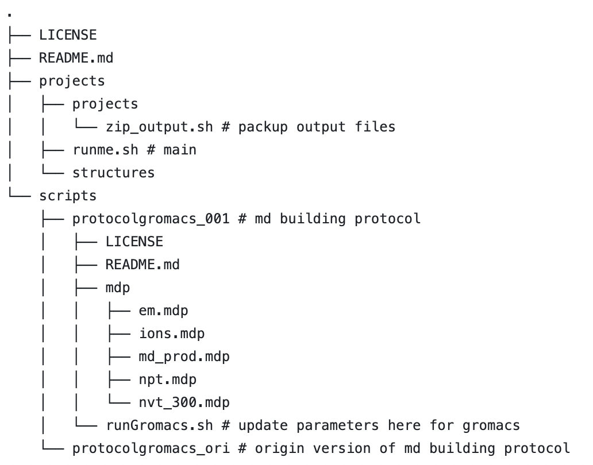

# AutoMdBuilder

Homemade scripts based on  [protocolGromacs](https://github.com/tubiana/protocolGromacs), for automatic md system building.

## 1. Installation

Please visit following links for more information about installation.

* [gromacs](https://manual.gromacs.org/current/install-guide/index.html)
* [protocolGromacs](https://github.com/tubiana/protocolGromacs)

## 2. Directory Structure



## 3. Usage

### for single protein or single protein + single ligand

The working directory is 'ROOT/projects/'. The script 'runme.sh' will first check PDB files in 'ROOT/projects/structures', then create new directories under 'projects/projects' for each structure, and perform MD system building, minimization, NVT equilibration, NPT equilibration, and so on, as set up in 'ROOT/scripts/protocolgromacs_single_ligand'.

1. Refine PDB files and copy them to 'projects/structures'.
2. Update parameters for GROMACS in 'scripts/protocolgromacs_single_ligand':

   * 'ROOT/scripts/protocolgromacs_single_ligand/runGromacs.sh'
   * 'ROOT/scripts/protocolgromacs_single_ligand/mdp/*.mdp'
3. Change the directory to 'projects/'.
4. Run the script 'runme_single_protein_single_ligand.sh'.

```bash
########################
# for pure protein 
########################
# prepare scripts 
git clone https://github.com/GiantFurosemide/AutoMdBuilder.git
cp -r ./AutoMdBuilder /path/to/work/

# define ROOT and work directory (not necessary for production)
export MY_ROOT=/path/to/work/AutoMdBuilder
export MY_WORK_DIR=$MY_ROOT/projects

# update mdp files (temperature\timestep\constraint...)
#cd  $MY_ROOT/scripts/protocolgromacs_multiple_ligands
#...

# copy prepared structure files to $MY_WORK_DIR/structures
mkdir -p $MY_WORK_DIR/structures
cp -v pure-protein_1.pdb $MY_WORK_DIR/structures/
cp -v pure-protein_2.pdb $MY_WORK_DIR/structures/
cp -v pure-protein_3.pdb $MY_WORK_DIR/structures/
...

# to work directory, run!
cd $MY_WORK_DIR
source runme_single_protein_single_ligand.sh


########################
# for protein + single ligand
########################
# prepare scripts 
...
# define ROOT and work directory (not necessary for production)
...
# update mdp files (temperature\timestep\constraint...)
...

# copy prepared structure files to $MY_WORK_DIR/structures
mkdir -p $MY_WORK_DIR/structures
cp -v complex_1.pdb $MY_WORK_DIR/structures/
cp -v complex_2.pdb $MY_WORK_DIR/structures/
cp -v complex_3.pdb $MY_WORK_DIR/structures/

# to work directory, run!
# cause all ligand info defined in runme_single_protein_single_ligand.sh
# complex_1.pdb,complex_2.pdb,complex_3.pdb suposed to contain same ligands
# if complexes consist of different type of ligands,please use 'runme_single_protein_multiple_ligands.sh'
cd $MY_WORK_DIR
source runme_single_protein_single_ligand.sh

```

### for single protien + multiple ligands

1. Prepare structure file and scripts and copy them to 'ROOT/projects/structures/case1, case2, case3...'. Each sub-directoryshould contain following files( for example case1 is a MD system consist of one protein and two types of ligands,each type with ten ligands):

* complex.pdb (protein-ligand complex pdb file)
* ligand1_GMX.itp, ligand2_GMX.itp ( itp file generated by acpype)
* ligand1_NEW.pdb, ligand2_NEW.pdb (PDB file generated by acpype)
* ligand_info_prepare.py (update ligand info)
* mdbuild_add_multi_ligands.sh(update md system info)

2. Update parameters for GROMACS in 'scripts/protocolgromacs_multiple_ligands':

* 'ROOT/scripts/protocolgromacs_multiple_ligands/mdp/*.mdp'

3. Change the directory to 'ROOT/projects/'.
4. Run the script 'runme_single_protein_multiple_ligands.sh'.

```bash
# prepare scripts 
git clone https://github.com/GiantFurosemide/AutoMdBuilder.git
cp -r ./AutoMdBuilder /path/to/work/

# define ROOT and work directory (not necessary for production)
export MY_ROOT=/path/to/work/AutoMdBuilder
export MY_WORK_DIR=$MY_ROOT/projects

# update mdp files (temperature\timestep\constraint...)
#cd  $MY_ROOT/scripts/protocolgromacs_multiple_ligands
#...

# copy prepared structure files and scripts to 'case1' under $MY_WORK_DIR/structures
mkdir -p $MY_WORK_DIR/structures/case1
cp -v complex.pdb $MY_WORK_DIR/structures/case1
cp -v ligand1_GMX.itp $MY_WORK_DIR/structures/case1
cp -v ligand2_GMX.itp $MY_WORK_DIR/structures/case1
cp -v ligand1_NEW.pdb $MY_WORK_DIR/structures/case1
cp -v ligand2_NEW.pdb $MY_WORK_DIR/structures/case1
cp -v ligand_info_prepare.py $MY_WORK_DIR/structures/case1
cp -v mdbuild_add_multi_ligands.sh $MY_WORK_DIR/structures/case1

# to work directory, run!
cd $MY_WORK_DIR
source runme_single_protein_multiple_ligands.sh


```

## 4. TODO

* update supporting for multiple ligands
* update logging
